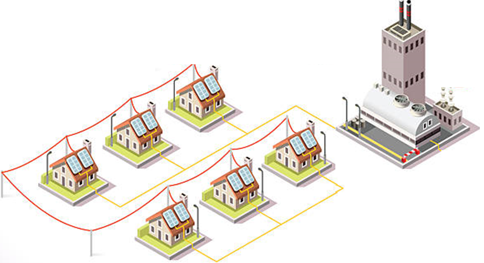

# Power Grid Development for Flåklypa
## Data Structures and Algorithms - INF102 Semester Assignment 2
This project involved the development of a power grid for the town of Flåklypa. The grid connects all houses requiring electricity and includes contingency planning for power outages. The solution was implemented with a focus on efficient data structures and algorithms, adhering to the specifications provided in the IProblem interface.

# Project Overview
Simplified Power Grid Model: A single type of power cable was assumed for the entire grid, and power requirements across connections were treated uniformly.
Power Outage Mitigation: Algorithms were developed to identify optimal cable placements to minimize the number of houses affected during outages.

# Key Features
Optimized Cable Network: Implemented algorithms to ensure all houses are connected with minimal cable usage while maintaining redundancy for outages.
Outage Resilience: Designed strategies to add backup connections that minimize the impact of cable failures.
Interactive Visualization: Solutions can be visualized by running Main.java, allowing real-time inspection of the grid and cable connections.

# Visualization Guide
The visualization tool provides an interactive way to test and analyze the power grid solution. For more details, refer to the [Visualizer Instructions](./guide/visualizer.md).

# Supporting Documentation
- [Task 1 Implementation Details](./guide/task1.md)  
- [Task 2 Implementation Details](./guide/task2.md)  
- [Task 3 Implementation Details](./guide/task3.md)  

